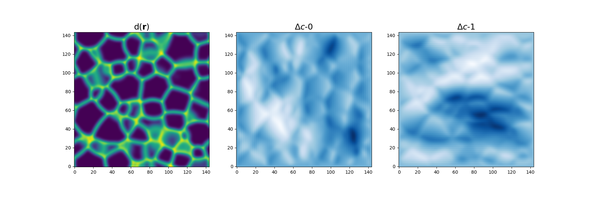

# FDSolverPy

Parallelized finite-difference module for solving physics problem. Here are some notable feature of this library:
1. Adaptability:
   - all parallel-related functionalities are implemented in the `base/ParallelSolver.py`
   - To setup a solver, user can can inherit the `parallel_solver` class and implement the energy `F`, gradient `dF`, and `run` function.

3. Numerical stability: implemented the Neumaier compensated summation, giving stable and accurate calculation of loss function
   - More accurate than `sum` or `np.sum` functions; faster than `math.fsum` accurate summation functions.
   - Reproducibility of results regardless of parallelization setup


## Installation

The installation time is typically within 5 minutes on a normal local machine.

Dependencies:
- `numpy`
- `mpi4py`
- `numba`
- `matplotlib`

An example for the installation process:

To install `FDSolverPy`, clone this repo:
```bash
git remote add origin git@github.com:bumpwy/FDSolverPy.git
```
and run:
```bash
pip install -e /path/to/the/repo
```

The `-e` option allows you to edit the source code without having to re-install.

To uninstall:
```bash
pip uninstall FDSolverPy
```

## Examples
### I. test runs
Examples can be found in the `./test` directory. 
For instance, under `./tests/local/2d/microstruct` contains examples for diffusion problem in a microstructure.
```bash
./run.py
```
and to plot the results do
```
./plot.py
```
and you shall obtain


where $d(\bf{r})$ is the polycrystalline diffusivity, $\Delta c$'s are the perturbative concentration fields for 
driving force in $Q_0 = (1,0)$ and $Q_1 = (0,1)$ directions.

### II. stability
As mentioned above, a parallelized stable&fast summation function is implemented in this library. Here we give a more detailed description:
   - In most optimization codes, the loss function (or the "energy functional") requires a summation step (e.g. sum of all square errors). Here are some typical choices:
      - `sum()`: the python built-in. Fast but very unstable due to floating point errors
      - `np.sum()`: the `numpy` implementation of sum. Fast ans uses partial pair-wise summation, sometimes leads to improved stability.
      - `math.fsum()`: an accurate summation function from the `math` library. Slow but highly accurate (Shewchuck algorithm); even slower in parallel calculations.
   - In `FDSolverPy` we implemented the Neumaier summation algorithm and also parallelized it. This allows for fast and accurate (in theory less accurate than Shewchuck) summations, and can be run in parallel. 

Below we show an example on a 288x288 grid optimization. In the energy vs. iteration plot we compare `sum`, `np.sum`, and `stable` (our method), across 1, 2, and 4 cpus. 
1. One can see that the `sum` method exhibits rapid oscillations in the energy, and converges slower as number of cpus increases.
2. The `np.sum` exhibits stable values and converges steadily at 1 cpu; however, with 2 or 4 cpus, the convergence stalls completely
3. Our `stable` method exhibit extremely stable and steady convergence, and gives identical results across 1, 2, and 4 cpus. In this case, they are at least identical up to 40 digits (a double (64-bit) is accurate up to 15 digits)

We note that while the differences in energies are rather small (~1e-6) in a 288x288 grid calculation, numerical stability can be critical in 1) highly-precise physics modeling or 2) larger systems with massive parallel calculations, e.g. 288x288x288 3D grid with >100 cpus, where numerical errors are magnified.


